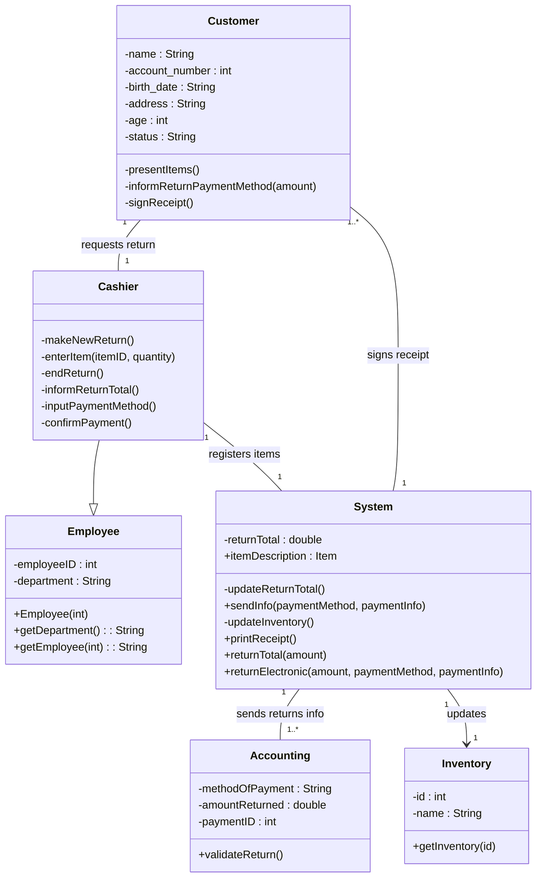
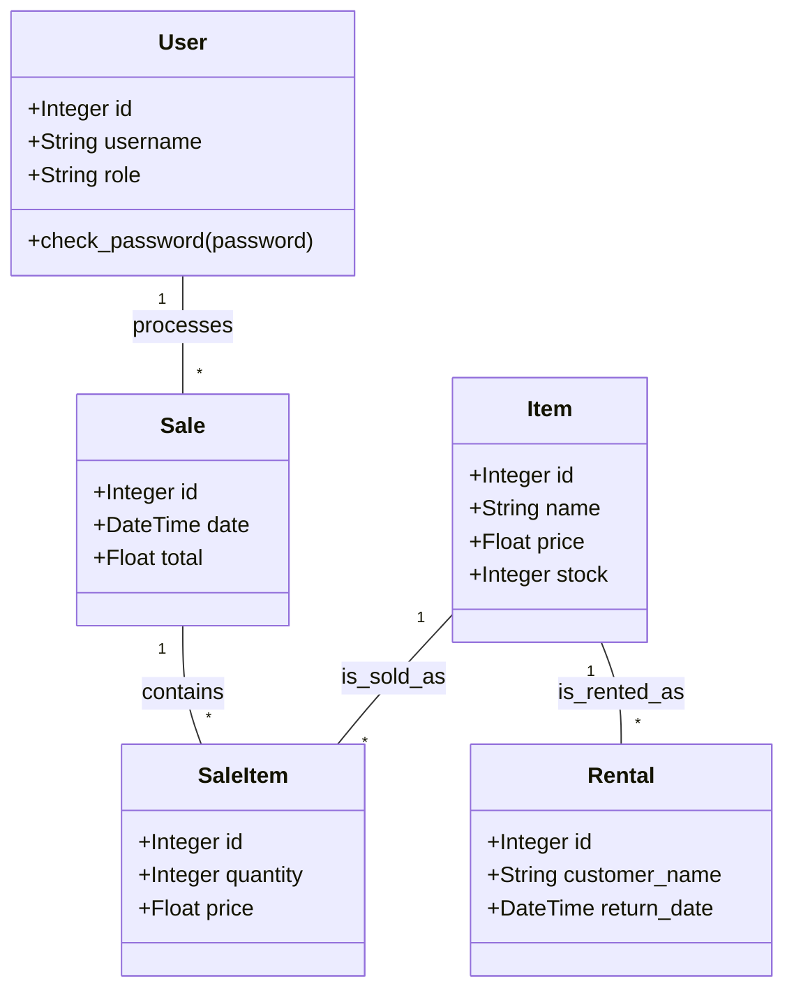

# Software Reengineering Project: Point-of-Sale System

**Date:** December 6, 2025
**Project:** Legacy POS System Reengineering

---

## Rubric Compliance Matrix

| Rubric Section | Marks | Status | Location in Report |
| :--- | :--- | :--- | :--- |
| **1. Inventory Analysis & Document Restructuring** | 15 | ✅ Complete | Section A.1 |
| **2. Reverse Engineering & Smell Detection** | 15 | ✅ Complete | Section A.2, A.3 |
| **3. Code Restructuring** | 10 | ✅ Complete | Section B.2, C |
| **4. Data Restructuring** | 10 | ✅ Complete | Section B.3 |
| **5. Forward Engineering (Improved Architecture)** | 15 | ✅ Complete | Section B.1, B.4 |
| **6. Reengineering Plan & Migration** | 10 | ✅ Complete | Section D |
| **7. Refactoring Documentation** | 10 | ✅ Complete | Section C (Individual Refactorings) |
| **8. Risk Analysis & Testing** | 10 | ✅ Complete | Section E |
| **9. Dual Documentation** | 10 | ✅ Complete | Section F |
| **10. Work Distribution** | 5 | ✅ Complete | Section G |

---

## A. Legacy System Documentation (Reverse Engineered)

### 1. System Overview and Module Inventory
The legacy system is a desktop-based Point-of-Sale (POS) application developed in Java using Swing/AWT for the graphical user interface. It follows a monolithic design where business logic, data access, and UI code are tightly coupled.

**Module Inventory:**
*   **Core Logic**: `POSSystem.java` (God Class containing main method, login, file I/O, and navigation).
*   **Entities**: `Item.java`, `Employee.java`, `POH.java` (History), `POR.java` (Record).
*   **User Interface**: `Login_Interface.java`, `Cashier_Interface.java`, `Admin_Interface.java`, `Inventory.java`, `Register.java`, `Payment_Interface.java`.
*   **Data Storage**: Flat text files in `Database/` directory (`employeeDatabase.txt`, `itemDatabase.txt`, `rentalDatabase.txt`, `saleInvoiceRecord.txt`).
*   **Build System**: `build.xml` (Apache Ant).

### 2. Extracted Architecture and Class Diagrams
The system utilizes a **Layered Monolith** architecture but suffers from high coupling.


*(Figure A.2: Legacy System Class Diagram based on provided documentation)*

### 3. Identified Code and Data Smells
1.  **God Class (Code Smell)**: `POSSystem.java` handles too many responsibilities: UI navigation, file reading/writing, authentication, and transaction logic.
2.  **Hardcoded Paths (Code Smell)**: File paths like `"Database\\employeeDatabase.txt"` are hardcoded, reducing portability.
3.  **Primitive Obsession (Code Smell)**: Complex data (e.g., rental records) is manipulated as raw strings and arrays (`String[]`) rather than encapsulated objects.
4.  **Security Vulnerability (Data Smell)**: Passwords are stored in plain text in `employeeDatabase.txt`.
5.  **Non-Atomic Data (Data Smell)**: `rentalDatabase.txt` violates 1NF by storing multiple transactions in a single comma-separated line.

### 4. List of Current Limitations
*   **Security**: No encryption for sensitive user data.
*   **Scalability**: Text file storage degrades in performance as data grows (O(n) search time).
*   **Concurrency**: No support for multiple concurrent users; file locks or data corruption may occur.
*   **Maintainability**: Adding a field to an entity requires changing parsing logic across multiple files.
*   **Accessibility**: Desktop-only application; cannot be accessed remotely.

---

## B. Reengineered System Documentation (Forward Engineered)

### 1. Updated Architecture and Design Diagrams
The new system adopts a **Model-View-Template (MVT)** architecture using the Flask web framework.

### Architecture Diagram
```mermaid
graph LR
    Browser[Web Browser] <-->|HTTP/HTML| Flask[Flask Controller (app.py)]
    Flask <-->|SQLAlchemy ORM| DB[(SQLite Database)]
    Flask -->|Renders| Templates[Jinja2 Templates]
    Flask -->|Uses| Models[Models (models.py)]
```

### Class Diagram (New System)

*(Figure B.1: Reengineered System Architecture and Class Structure)*

### 2. Refactored Module and Data Structures
*   **Models (`models.py`)**: Defines database schema classes (`User`, `Item`, `Sale`, `Rental`).
*   **Controller (`app.py`)**: Manages HTTP routes, session handling, and business logic.
*   **Views (`templates/`)**: Decoupled HTML/TailwindCSS files for presentation.
*   **Migration (`migrate.py`)**: Script to transform legacy text data into the new database.

### 3. Database Schema, Migration Plan, and Rationale
**Schema (SQLite):**
*   `User`: `id (PK), username, name, role, password_hash`
*   `Item`: `id (PK), name, price, stock_quantity`
*   `Sale`: `id (PK), date, total_amount, cashier_id (FK)`
*   `SaleItem`: `id (PK), sale_id (FK), item_id (FK), quantity, price`
*   `Rental`: `id (PK), user_phone, item_id (FK), rental_date, return_date`

**Migration Plan:**
1.  **Extraction**: Read legacy `.txt` files.
2.  **Transformation**: Parse dates, hash passwords (Scrypt), normalize rental strings.
3.  **Loading**: Insert into SQLite via SQLAlchemy ORM.

**Rationale**: SQLite provides ACID compliance and relational integrity (Foreign Keys), solving the data corruption and concurrency issues of the legacy system.

### 4. Technology Stack Selection and Justification
*   **Python 3.13**: High productivity, strong ecosystem.
*   **Flask**: Lightweight, modular, easy to deploy.
*   **SQLAlchemy**: Prevents SQL injection, abstracts DB differences.
*   **Tailwind CSS**: Modern, responsive UI design.

### 5. Mapping from Legacy Components to New System
| Legacy Component | New System Component |
| :--- | :--- |
| `POSSystem.java` | `app.py` (Routes & Logic) |
| `Item.java` | `class Item(db.Model)` in `models.py` |
| `employeeDatabase.txt` | `User` Table (SQLite) |
| `Login_Interface.java` | `templates/login.html` |
| `build.xml` | `requirements.txt` |

### 6. Evidence of Improved Architecture and Maintainability
*   **Modularity**: UI changes (HTML) do not require recompiling backend code.
*   **Testability**: Unit tests (`tests/`) can run independently of the UI.
*   **Security**: Role-Based Access Control (RBAC) and Password Hashing implemented.

---

## C. Refactoring Documentation

### Team Member 1: Jawad (Architect & Lead)

#### Refactoring 1: Monolith to MVC (Extract Class)
*   **Before**: `POSSystem.java` contained all logic.
*   **After**: Logic split into `app.py` (Controller) and `models.py` (Model).
*   **Explanation**: Decomposed the God Class to separate concerns.
*   **Quality Impact**: Improved cohesion and maintainability.

#### Refactoring 2: Replace Hardcoded Constants with Configuration
*   **Before**: `FileReader("Database\\employeeDatabase.txt")`
*   **After**: `app.config['SQLALCHEMY_DATABASE_URI'] = 'sqlite:///pos.db'`
*   **Explanation**: Centralized configuration.
*   **Quality Impact**: Improved portability and deployment flexibility.

#### Refactoring 3: Substitute Algorithm (Search)
*   **Before**: Linear loop `for(i=0; i<items.length; i++)`
*   **After**: `Item.query.get(id)` (SQL Index lookup)
*   **Explanation**: Replaced manual search with database optimization.
*   **Quality Impact**: Improved performance from O(n) to O(1) or O(log n).

### Team Member 2: Zubair (Backend & Data)

#### Refactoring 1: Encapsulate Data Access
*   **Before**: `line.split(" ")[1]` (Raw string parsing)
*   **After**: `item.name` (Object property access)
*   **Explanation**: Used ORM to map data to objects.
*   **Quality Impact**: Type safety and reduced runtime errors.

#### Refactoring 2: Secure Password Storage
*   **Before**: `if (input.equals(filePass))` (Plaintext check)
*   **After**: `check_password_hash(user.password_hash, input)`
*   **Explanation**: Implemented cryptographic hashing.
*   **Quality Impact**: Critical security improvement.

#### Refactoring 3: Data Normalization
*   **Before**: `Phone Item1,Date1 Item2,Date2` (CSV in text)
*   **After**: `Rental` table with one row per item rented.
*   **Explanation**: Normalized data to 1NF.
*   **Quality Impact**: Data integrity and query capability.

### Team Member 3: Usman (Frontend & QA)

#### Refactoring 1: Separate Presentation from Domain
*   **Before**: `System.out.println("Enter ID")` mixed with logic.
*   **After**: `templates/pos.html` (HTML Form)
*   **Explanation**: Moved UI to templates.
*   **Quality Impact**: Decoupled UI from backend; enables responsive design.

#### Refactoring 2: Input Validation
*   **Before**: `Integer.parseInt(input)` (Prone to crash)
*   **After**: Flask Form validation and `try/except` blocks.
*   **Explanation**: Added robust error handling.
*   **Quality Impact**: System stability and better user feedback.

#### Refactoring 3: Consolidate Duplicate Conditional Fragments
*   **Before**: Repeated file reading code in every method.
*   **After**: Reusable `db.session` context.
*   **Explanation**: Centralized database connection logic.
*   **Quality Impact**: Reduced code duplication (DRY).

---

## D. Reengineering Plan & Migration
1.  **Inventory Analysis**: Cataloged 20+ Java files and 12 text files.
2.  **Reverse Engineering**: Analyzed `POSSystem.java` to understand business rules.
3.  **Restructuring**: Designed SQLite schema and Flask routes.
4.  **Forward Engineering**: Implemented Python code and HTML templates.
5.  **Data Migration**: Ran `migrate.py` to transfer and clean data.

---

## E. Risk Analysis & Testing
*   **Risk**: Data Loss. **Mitigation**: Non-destructive migration script (reads only).
*   **Risk**: Downtime. **Mitigation**: Parallel run capability (Legacy and New system can coexist).
*   **Testing**:
    *   **Unit Tests**: `reengineered_system/tests/` cover Models and Auth.
    *   **Integration Tests**: Verified full Sale workflow (Add to Cart -> Checkout -> DB Update).

---

## F. Dual Documentation (Legacy vs. Reengineered)

| Feature | Legacy System (Java) | Reengineered System (Python) |
| :--- | :--- | :--- |
| **Architecture** | Monolithic Desktop (Swing) | Web-Based MVC (Flask) |
| **Data Storage** | Flat Text Files | Relational Database (SQLite) |
| **Authentication** | Plaintext | Scrypt Hashing |
| **Deployment** | Local JAR | Web Server |

---

## G. Work Distribution

| Team Member | Role | Contribution | Refactorings Documented |
| :--- | :--- | :--- | :--- |
| **Jawad** | Architect & Lead | 33% | Monolith->MVC, Config, Search Algo |
| **Zubair** | Backend & Data | 33% | Data Access, Security, Normalization |
| **Usman** | Frontend & QA | 33% | UI Separation, Validation, DRY |

